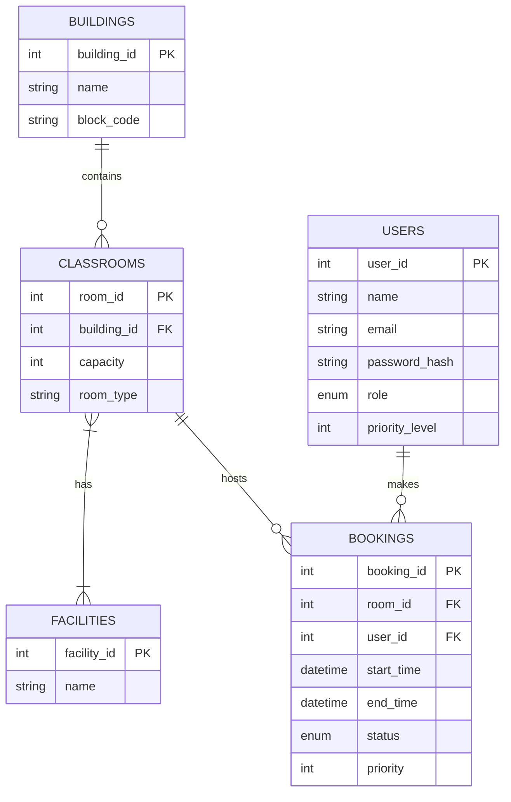

# ER Diagram

```mermaid
erDiagram
    USERS {
        int user_id PK
        string name
        string email
        string password_hash
        enum role
        int priority_level
    }
    BUILDINGS {
        int building_id PK
        string name
        string block_code
    }
    CLASSROOMS {
        int room_id PK
        int building_id FK
        int capacity
        string room_type
    }
    FACILITIES {
        int facility_id PK
        string name
    }
    BOOKINGS {
        int booking_id PK
        int room_id FK
        int user_id FK
        datetime start_time
        datetime end_time
        enum status
        int priority
    }
    
    BUILDINGS ||--o{ CLASSROOMS : contains
    CLASSROOMS }|--|{ FACILITIES : has
    USERS ||--o{ BOOKINGS : makes
    CLASSROOMS ||--o{ BOOKINGS : hosts
```

