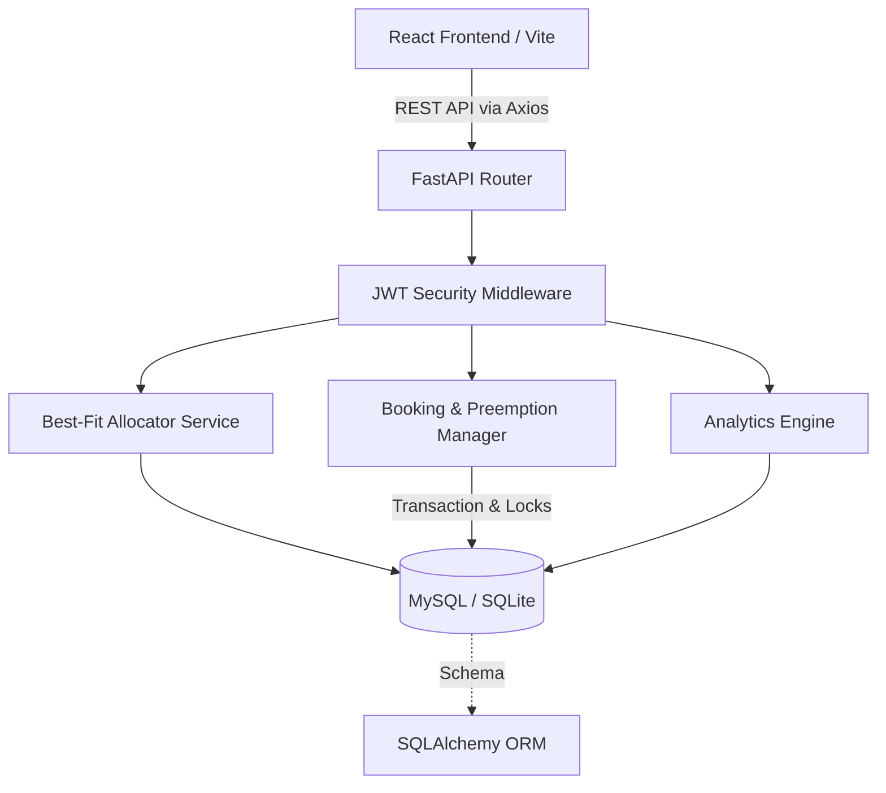

# Architecture Diagram

```mermaid
graph TD;
    Client[React Frontend / Vite] -->|REST API via Axios| Gateway[FastAPI Router];
    Gateway --> Auth[JWT Security Middleware];
    Auth --> Allocator[Best-Fit Allocator Service];
    Auth --> BookManager[Booking & Preemption Manager];
    Auth --> Dash[Analytics Engine];
    
    Allocator --> DB[(MySQL / SQLite)];
    BookManager -->|Transaction & Locks| DB;
    Dash --> DB;
    
    DB -.->|Schema| Models[SQLAlchemy ORM];
```

